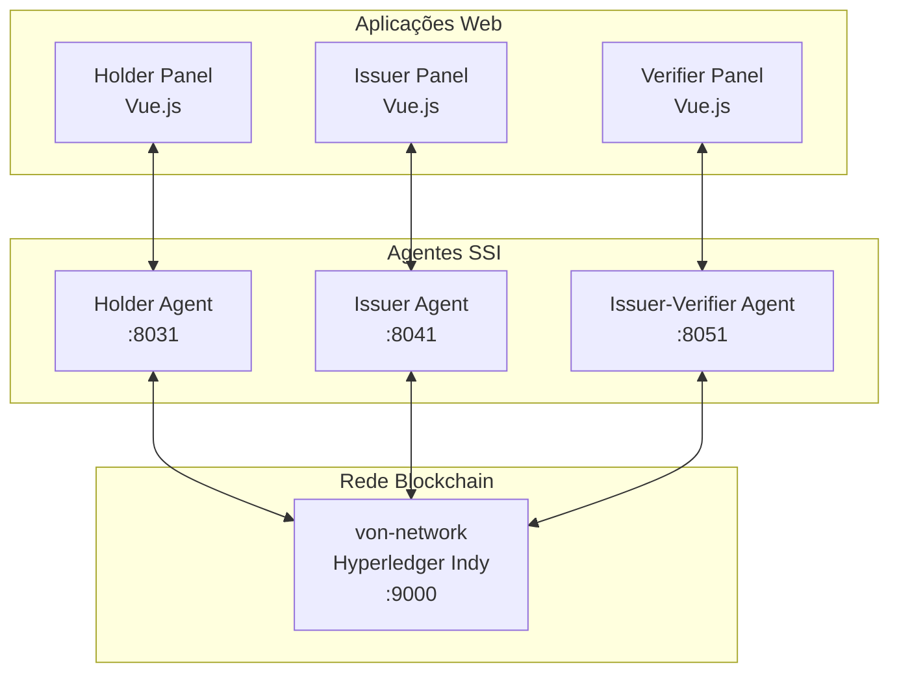

# 🔐 Prova de Conceito - Sistema de Identidade Soberana (SSI)

[](https://python.org)
[](https://docker.com)
[](https://www.hyperledger.org/use/hyperledger-indy)
[](https://github.com/hyperledger/aries-cloudagent-python)

## 📋 Sobre o Projeto

Este projeto demonstra o funcionamento completo de um fluxo **Self-Sovereign Identity (SSI)** utilizando as tecnologias Hyperledger Indy e Aries Cloud Agent Python (ACA-Py). A implementação apresenta um ecossistema com três agentes principais que simulam cenários reais de emissão, armazenamento e verificação de credenciais digitais.

### 🎯 Objetivo

Demonstrar na prática como funciona um sistema de identidade soberana, onde os usuários têm controle total sobre suas credenciais digitais, podendo provar informações específicas sem revelar dados desnecessários.

### 🌟 Exemplo Prático

**Cenário**: Validação de maioridade para ingresso universitário

1. **Governo** (Issuer) emite uma credencial de RG digital
2. **Pessoa** (Holder) recebe e armazena a credencial em sua carteira digital
3. **Faculdade** (Verifier/Issuer) solicita prova de maioridade
4. **Pessoa** prova apenas que é maior de idade, **sem revelar a data de nascimento**
5. **Faculdade**, com base na prova validada, emite uma credencial de matrícula

## 🏗️ Arquitetura do Sistema



## 🚀 Tecnologias Utilizadas

### Backend & SSI
- **Python 3.12** - Linguagem principal
- **FastAPI** - Framework web para APIs REST
- **ACA-Py (Aries Cloud Agent Python)** - Agente para protocolos SSI
- **AriesController** - Wrapper Python para simplificar integração com ACA-Py
- **von-network** - Rede de desenvolvimento Hyperledger Indy

### Frontend
- **Vue.js 3** - Framework JavaScript para interfaces web modernas
- **Docker & Docker Compose** - Containerização e orquestração

### Infraestrutura
- **Docker** - Containerização
- **Hyperledger Indy** - Blockchain para identidade descentralizada
- **SQLite** - Armazenamento local dos agentes

## 📁 Estrutura do Projeto

```
tcc-poc-ssi-final/
├── 📁 docker/                      # Configurações Docker
│   ├── docker-compose.yml          # Orquestração dos containers SSI
│   └── files-to-replace/           # Arquivos customizados para von-network
│       ├── Dockerfile              # Build personalizado
│       ├── docker-compose.yml      # Configuração von-network
│       └── requirements.txt        # Dependências Python
├── 📁 db/                          # Bancos de dados locais
│   ├── holder.db                   # Dados do agente Holder
│   ├── issuer.db                   # Dados do agente Issuer
│   └── verifier-issuer.db          # Dados do agente Verifier-Issuer
├── 📁 shared/                      # Dependências compartilhadas
│   └── requirements.txt            # Requisitos Python do projeto
├── 📁 src/                         # Código fonte das aplicações
│   ├── 📁 holder/                  # Aplicação do portador
│   │   ├── api/                    # API Backend (FastAPI)
│   │   └── painel/                 # Interface Web (Vue.js)
│   ├── 📁 issuer/                  # Aplicação do emissor
│   │   ├── api/                    # API Backend (FastAPI)
│   │   └── painel/                 # Interface Web (Vue.js)
│   └── 📁 issuer-verifier/         # Aplicação do verificador/emissor
│       ├── api/                    # API Backend (FastAPI)
│       └── painel/                 # Interface Web (Vue.js)
└── make                            # Script de automação e gerenciamento
```

## 🔧 Pré-requisitos

Antes de iniciar, certifique-se de ter instalado:

- **Docker** (versão 20.10+)
- **Docker Compose** (versão 2.0+)
- **Git** (para clonagem de repositórios)
- **curl** (para verificações de saúde)

### Verificação de Instalação

```bash
# Verificar Docker
docker --version && docker compose version

# Verificar Git e curl
git --version && curl --version
```

## 🚀 Como Executar o Projeto

### 1. Inicialização Completa do Ambiente

```bash
# Dar permissão de execução ao script
chmod +x make

# Iniciar todo o ambiente SSI
./make
# Selecione: alias

stw
# Seleciona: container -> run
```

**O que acontece automaticamente:**

1. 📦 Clona o repositório `von-network` (se não existir)
2. 🔧 Aplica configurações customizadas
3. 🏗️ Constrói a rede blockchain Hyperledger Indy
4. 🌐 Inicia a von-network (porta 9000)
5. ⏳ Aguarda confirmação de que a rede está online
6. 🚀 Inicia os agentes ACA-Py (portas 8031, 8041, 8051)
7. ✅ Configura DIDs públicos para emissores

### 2. Acesso às Interfaces

Após a inicialização bem-sucedida, acesse:

| Serviço | URL | Descrição |
|---------|-----|-----------|
| **von-network** | [http://localhost:9000](http://localhost:9000) | Interface da blockchain Indy |
| **Holder Agent** | [http://localhost:8031](http://localhost:8031) | API Swagger do Portador |
| **Issuer Agent** | [http://localhost:8041](http://localhost:8041) | API Swagger do Emissor |
| **Verifier Agent** | [http://localhost:8051](http://localhost:8051) | API Swagger do Verificador |

### 3. Gerenciamento do Ambiente

```bash
# Parar todos os containers
stw
# Selecione: container -> stop

# Limpeza completa (containers, volumes, imagens)
stw
# Selecione: container -> clear

# Ajuda detalhada
stw
# Selecione: container -> help
```

## 🔄 Fluxo de Demonstração SSI

### Fase 1: Configuração Inicial
1. **Emissor** registra um schema de credencial na blockchain
2. **Emissor** cria uma definição de credencial baseada no schema
3. **Holder** e **Emissor** estabelecem conexão via convite

### Fase 2: Emissão de Credencial
1. **Emissor** oferece credencial (ex: RG digital) para o **Holder**
2. **Holder** aceita a oferta de credencial
3. **Emissor** emite a credencial com atributos (nome, data nascimento, etc.)
4. **Holder** armazena a credencial em sua carteira digital

### Fase 3: Verificação e Prova
1. **Verifier** solicita prova específica (ex: maior de 18 anos)
2. **Holder** gera prova sem revelar dados sensíveis
3. **Verifier** valida a prova matematicamente
4. **Verifier** emite nova credencial baseada na prova (ex: matrícula)

## 🛠️ Funcionalidades do Script `make`

O script `make` é uma ferramenta completa para gerenciar o projeto:

### Módulos Disponíveis

#### 🐳 Container Management
- **`run`** - Inicia ambiente SSI completo
- **`stop`** - Para todos os containers
- **`clear`** - Remove containers e volumes
- **`help`** - Documentação detalhada

#### 🌿 Git Operations
- **`branch`** - Cria branches com convenção de commits
- **`commit`** - Commits padronizados (feat/fix/chore)
- **`push`** - Push para repositório remoto
- **`deploy`** - Versionamento e release

#### ⚙️ Utilitários
- **`alias`** - Instala comando global `stw` (steward)
- **`help`** - Ajuda geral do sistema

## 🔍 Detalhes Técnicos

### Agentes ACA-Py

Cada agente roda com configurações específicas:

- **Wallet Type**: Askar (moderno e performático)
- **Auto-responses**: Habilitado para demonstração
- **Genesis URL**: Conectado à von-network local
- **Admin API**: Interface REST para interação

### Rede von-network

- **Nodes**: 4 validadores Indy rodando em cluster
- **Consensus**: Algoritmo PBFT (Practical Byzantine Fault Tolerance)
- **Ports**: 9701-9708 para comunicação entre nodes
- **Web Interface**: Porta 9000 para visualização

### Segurança e Desenvolvimento

⚠️ **Aviso de Segurança**: Este ambiente é configurado para **desenvolvimento apenas**:
- Modo `admin-insecure-mode` habilitado
- Seeds fixas para reprodutibilidade
- Auto-aceitar convites e credenciais

**Nunca use essas configurações em produção!**

### Convenções de Commit

- `feat(escopo): nova funcionalidade`
- `fix(escopo): correção de bug`
- `chore(escopo): manutenção, config, deps`

## 📚 Recursos Adicionais

### Documentação Oficial
- [Hyperledger Indy](https://hyperledger-indy.readthedocs.io/)
- [Aries Cloud Agent Python](https://aries-cloudagent-python.readthedocs.io/)
- [von-network](https://github.com/bcgov/von-network)

### Conceitos SSI
- [Self-Sovereign Identity Principles](https://www.lifewithalacrity.com/2016/04/the-path-to-self-soverereign-identity.html)
- [Verifiable Credentials Data Model](https://www.w3.org/TR/vc-data-model/)
- [Decentralized Identifiers (DIDs)](https://www.w3.org/TR/did-core/)

## 📄 Licença

Este projeto está sob a licença MIT. Veja o arquivo [LICENSE](LICENSE) para mais detalhes.

## 👥 Equipe

Desenvolvido como parte do Trabalho de Conclusão de Curso (TCC) em Ciência da Computação.

---

⭐ **Se este projeto foi útil, considere dar uma estrela no repositório!**

🔗 **Links Rápidos**: [Documentação](README.md) | [Issues](issues) | [Discussions](discussions)


## A Fazer

migrar escopo de recebimento de URL

migrar escopo do issuer

iniciar escopo do issuer-verifier